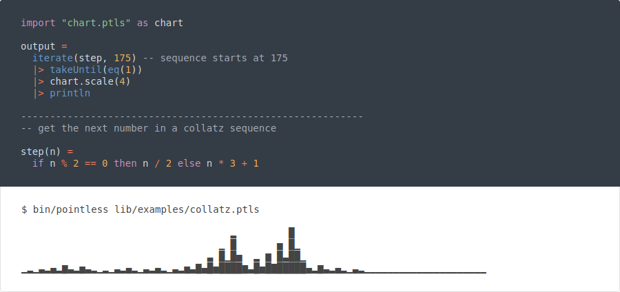

## Pointless: A Scripting Language for Learning and Fun (version 0.1.0)



#### Documentation and examples at [https://ptls.dev]()

Pointless 0.1.0 brings a number of changes from the initial release, informed by feedback and experience. The latest implementation of Pointless is interpreter, rather than compiled, and is written in Dart. This move marks a deemphasis on performance with a focus instead on improved language design and faster development. It's my hope that the new Dart-based implementation will make Pointless easier for others to install, use, and modify.

New utilities:

- A repl for interactive programming
- An web-based language playground
- Auto-generated API docs for prelude functions

Language updates:

- Syntax consolidation and updates
- Better error messages with location information for incorrect types
- (showing where in the code the incorrect type came from)
- Explicit exports for multi-file projects
- Expanded standard library
- Try / Catch error handling mechanism
- Labels support for objects

Implementation updates:

- A smaller, easier to edit codebase
- Improved Windows support
- Bug fixes
- MIT licensed source code

Site updates:

- Updated documentation
- More in-depth examples
- Automatic syntax highlighting
- Faster loading

### Installation

You can [try Pointless online](https://ptls.dev/online) without installing.  
To install Pointless locally, you'll need to have [Git](https://git-scm.com/downloads) installed to clone the repository, as well as the [Dart SDK](https://dart.dev/get-dart).

Installing on Linux, Mac and Windows (PowerShell):

1. Clone the repository

    ```
    git clone https://github.com/pointless-lang/pointless.git
    ```

2. Enter the repo directory

    ```
    cd pointless
    ```

3. Download Dart dependencies:

    ```
    pub get
    ```

4.  You can now run the Pointless repl using:

    ```
    dart lib/pointless.dart
    ```

    or supply a path to a file to run; for example:

    ```
    dart lib/pointless.dart examples/beer/beer.ptls
    ```

    (for repl readline support, try [rlwrap](https://github.com/hanslub42/rlwrap)) 

### Compiling the interpreter with dart2native:

Compiling the interpreter avoids the startup overhead of the Dart VM.

After performing the steps above:

- Linux and Mac:

    Run the following commands in the repository root (generates ./bin/pointless):
  
    ```
    dart2native lib/pointless.dart -o bin/pointless
    ```

    Alternatively, using Make, simply run:

    ```
    make
    ```

    Now you can run Pointless like this:

    ```
    bin/pointless examples/beer/beer.ptls
    ```

- Windows:

    Run the following commands in the repository root (generates ./bin/pointless.exe):

    ```
    dart2native lib/pointless.dart -o bin/pointless.exe
    ```

    Now you can run Pointless like this:

    ```
    bin/pointless.exe examples/beer/beer.ptls
    ```

Contributions are welcome!
